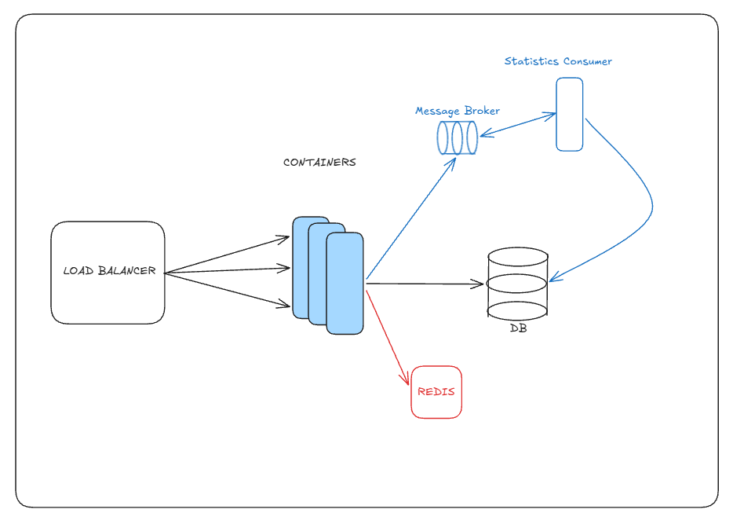

<h1 align="center">🔗 URL Shortner</h1>

<p align="center">
  Encurtador de URLs escalável com login Google, estatísticas de acesso e processamento assíncrono.<br/>
  Feito com <b>NestJS</b>, <b>PostgreSQL</b>, <b>Redis</b>, <b>RabbitMQ</b> e <b>nginx</b>.
</p>

<p align="center">
  
  
  
  
  
  
  
  
</p>

---

## ✨ O que ele faz

- **Encurta URLs** e redireciona (302) com cache no Redis.
- **Login só com Google (SSO).** Quem está logado tem os links atrelados à sua conta e consulta as estatísticas deles.
- **Criar link sem login também funciona**: o link fica sem dono, mas os acessos continuam sendo registrados, e o dono do app (admin) enxerga tudo.
- **Registra cada acesso** (IP, navegador, origem do clique) de forma assíncrona: a API publica um evento no RabbitMQ e um consumer separado grava no banco, sem pesar o redirect.
- **Escala horizontalmente**: nginx na frente, balanceando entre várias réplicas da API.
- **Frontend em Next.js**: criar link, "Meus links" com estatísticas e painel do admin.

## 🗺️ Arquitetura

<p align="center">
  
</p>

```
 navegador ─► frontend (Next.js, :5173)
     │              │ chama a API (cookie de sessão)
     ▼              ▼
   nginx ─►┌─────────────┐
 (porta 80)│ backend x N │──► Redis      (cache de redirects)
           │   (NestJS)  │──► PostgreSQL (links, usuários, acessos)
           └──────┬──────┘
                  │ evento "link.accessed"
                  ▼
              RabbitMQ ──► statistics_consumer ──► PostgreSQL (tabela Access)
```

| Pasta | Papel |
|---|---|
| `frontend/` | Next.js: interface (criar link, meus links, estatísticas, admin) |
| `backend/` | API NestJS: encurtar, redirecionar, auth e estatísticas |
| `statistics_consumer/` | App Nest separado (sem HTTP) que consome os eventos do RabbitMQ e grava os acessos |
| `nginx/` | Configuração do load balancer |
| `docker-compose.yaml` | Sobe tudo (infra + backend + consumer + nginx + frontend) |

### Fluxo de um acesso

1. `GET /abc1234` chega no nginx, que escolhe uma réplica da API.
2. A API busca o destino no **Redis**. Num miss, busca no Postgres e popula o cache (TTL de 12h).
3. A API **responde o 302** e publica `link.accessed` (`id`, horário, IP, User-Agent e referer) no RabbitMQ, sem esperar.
4. O **consumer** recebe o evento, grava na tabela `Access` e confirma (`ack`). Se o insert falhar, devolve a mensagem para a fila (`nack` com requeue).

Se o RabbitMQ cair, o redirect continua funcionando (só o registro do acesso é perdido). Se o consumer cair, as mensagens esperam na fila e são processadas quando ele voltar.

### Arquitetura interna (hexagonal)

O `backend/` segue **ports & adapters**: domínio e casos de uso só conhecem interfaces, e Postgres, Redis, RabbitMQ e Google ficam em adapters.

```
backend/src
├── shortner/   # encurtar e redirecionar
├── auth/       # login Google, JWT, guards
├── stats/      # estatísticas do dono e do admin
├── config/     # módulo do Redis
└── prisma/     # contrato do banco (fonte da verdade do schema)
    cada módulo: adapters/{inbound,outbound} · application/{ports,services} · domain
```

## 🚀 Rodando tudo com Docker

**Pré-requisitos:** Docker.

```bash
cp .env.example .env     # preencha as variáveis de Auth (veja abaixo)

docker compose up -d --build --scale backend=3
```

Um comando só, na raiz, sobe Postgres, Redis, RabbitMQ, **3 réplicas da API**, o **consumer**, o nginx e o **frontend**. O container da API roda `prisma db update` ao iniciar, então as tabelas são criadas/atualizadas sozinhas.

| Serviço | Endereço |
|---|---|
| Frontend | http://localhost:5173 |
| API (via nginx) | http://localhost |
| Painel do RabbitMQ | http://localhost:15672 (`user` / `example`) |
| Postgres | `localhost:5432` (`user` / `example`, banco `mydb`) |

> Use sempre `--scale backend=N` ao rodar `up`, senão o compose volta para 1 réplica. A porta do frontend é configurável em `FRONTEND_PORT` (o padrão é 5173 porque a 3000 costuma estar ocupada por outros projetos).

Para ver os logs: `docker compose logs -f backend statistics_consumer`. Para derrubar: `docker compose down` (ou `down -v` para apagar também o banco).

### Ver o balanceamento

Cada resposta da API traz o header `X-Served-By` com o container que atendeu:

```bash
for i in $(seq 1 30); do curl -s -o /dev/null -D - localhost/<ID> | grep -i x-served | tr -d '
 '; echo; done | sort | uniq -c
```

### Desenvolvimento sem Docker (opcional)

Cada app roda com `npm run start:dev` (backend e consumer) ou `npm run dev` (frontend) dentro da própria pasta, apontando para Postgres/Redis/RabbitMQ do compose (`docker compose up -d db redis rabbitmq`). Use o `.env.example` de cada pasta.

## ⚙️ Variáveis de ambiente (`.env` na raiz)

| Variável | Descrição |
|---|---|
| `GOOGLE_CLIENT_ID` | Client ID OAuth 2.0 (tipo *Web*) do Google. Usado pelo backend e embutido no frontend no build |
| `JWT_SECRET` | Segredo que assina o JWT da sessão |
| `ADMIN_EMAILS` | E-mails (separados por vírgula) com acesso à visão de admin |
| `CORS_ORIGIN` | Origem(ns) do frontend liberadas no CORS (padrão `http://localhost:5173`) |
| `NEXT_PUBLIC_API_URL` | URL da API vista pelo navegador (padrão `http://localhost`) |
| `FRONTEND_PORT` | Porta do frontend no seu computador (padrão `5173`) |

As conexões com Postgres, Redis e RabbitMQ já estão configuradas no compose com os nomes dos serviços. Fora do Docker, o backend lê `DATABASE_URL`, `APP_URL`, `PORT`, `REDIS_URL` e `RABBITMQ_URL` (veja `backend/.env.example`).

> Como o `NEXT_PUBLIC_*` é embutido no bundle em tempo de build, mudou o `GOOGLE_CLIENT_ID` ou a API? Rebuild do frontend: `docker compose up -d --build frontend`.

### Configurando o login com Google

1. Em [console.cloud.google.com](https://console.cloud.google.com), vá em **APIs e serviços → Credenciais → Criar credenciais → ID do cliente OAuth** (tipo *Aplicativo da Web*).
2. Em **Origens JavaScript autorizadas**, adicione `http://localhost:5173` e `http://localhost` (e a URL de produção do frontend, quando houver). **URIs de redirecionamento** pode ficar vazio.
3. Copie o Client ID para `GOOGLE_CLIENT_ID` e gere um segredo para o JWT:
   ```bash
   node -e "console.log(require('crypto').randomBytes(32).toString('hex'))"
   ```

## 🔐 Autenticação

O frontend (SPA) usa o **Google Identity Services** para obter um *ID token* e o envia para o backend, que valida com o Google, cria/atualiza o usuário e grava um **JWT em cookie `httpOnly`** (7 dias). O front deve chamar a API com `credentials: 'include'`.

| Rota | Descrição |
|---|---|
| `POST /auth/google` | Body `{ "id_token": "..." }`. Faz login e seta o cookie |
| `GET /auth/me` | Usuário logado e se é admin |
| `POST /auth/logout` | Apaga o cookie |

Em produção (`NODE_ENV=production`) o cookie sai `Secure` + `SameSite=None`, o que exige HTTPS.

## 📡 API

### Links

```bash
# Criar (anônimo ou logado; se houver cookie de sessão, o link fica atrelado ao usuário)
curl -X POST http://localhost/shortner \
  -H "Content-Type: application/json" \
  -d '{ "destination_url": "https://github.com/TiagoAReiz" }'
# {"short_url":"http://localhost/aB3dE9x"}

# Acessar
curl -i http://localhost/aB3dE9x
# HTTP/1.1 302 Found
# Location: https://github.com/TiagoAReiz
```

A `destination_url` precisa ser uma URL válida **com protocolo**. ID inexistente retorna `404`. Os links expiram em 30 dias.

### Estatísticas

| Rota | Quem acessa | Retorna |
|---|---|---|
| `GET /me/links` | usuário logado | seus links com total de acessos |
| `GET /links/:id/stats` | dono do link ou admin | total, visitantes únicos, acessos por dia, top referers e top navegadores |
| `GET /admin/overview` | só admin | usuários, links com dono vs anônimos, total de acessos (e os de links anônimos), top 10 links |

Sem login a resposta é `401`. Usuário comum em link de outra pessoa (ou anônimo) recebe `403`. **Link anônimo só o admin enxerga.**

> "Visitantes únicos" é uma aproximação (IP + User-Agent distintos): IP não identifica uma pessoa. Atrás do nginx, o IP real vem do `X-Forwarded-For` (`trust proxy` ligado no Nest). No Docker Desktop do Windows, os testes locais mostram o IP do gateway (`172.19.0.1`).

## 🧪 Testes

```bash
cd backend && npm test               # auth, stats, shortner, repository, redis, publisher
cd statistics_consumer && npm test   # consumer
```

Todos usam mocks, sem precisar de Postgres, Redis ou RabbitMQ no ar.

## 🗄️ Banco de dados

O schema é definido no **contrato do Prisma 8** (`backend/src/prisma/contract.ts`), com três modelos: `User`, `Shortner` (com `user_id` opcional) e `Access`. Depois de mudar o contrato:

```bash
cd backend
npm run contract:emit    # regenera contract.json e contract.d.ts
```

O `docker compose up` aplica a mudança no banco automaticamente (`prisma db update`).

> ⚠️ O `statistics_consumer` tem uma **cópia** do contrato em `src/prisma/`. Enquanto isso não for unificado (veja o roadmap), copie `contract.json` e `contract.d.ts` do backend sempre que o modelo mudar.

## 🛠️ Stack

- [NestJS](https://nestjs.com/) + TypeScript
- [Prisma 8](https://www.prisma.io/) para acesso ao PostgreSQL
- [Redis](https://redis.io/) como cache
- [RabbitMQ](https://www.rabbitmq.com/) como message broker
- [nginx](https://nginx.org/) como load balancer
- [google-auth-library](https://www.npmjs.com/package/google-auth-library) + JWT para auth
- [Next.js](https://nextjs.org/) + Tailwind no frontend
- [Vitest](https://vitest.dev/) para testes

## 🗺️ Roadmap

- [x] Criação e redirecionamento de links
- [x] Cache com Redis
- [x] Message broker (RabbitMQ) e consumer de acessos
- [x] Load balancer (nginx) com múltiplas réplicas
- [x] Login com Google e links atrelados ao usuário
- [x] Estatísticas por link (dono) e visão geral (admin)
- [x] Frontend (Next.js) e todos os serviços containerizados no mesmo compose
- [ ] Contrato do Prisma controlado só pelo backend (pacote compartilhado)
- [ ] Migrações formais (`migration plan` + `db migrate`) em vez de `db update`
- [ ] Estatísticas agregadas no banco (SQL `GROUP BY`) para escala
- [ ] Chave estrangeira `Shortner.user_id → User.id`
